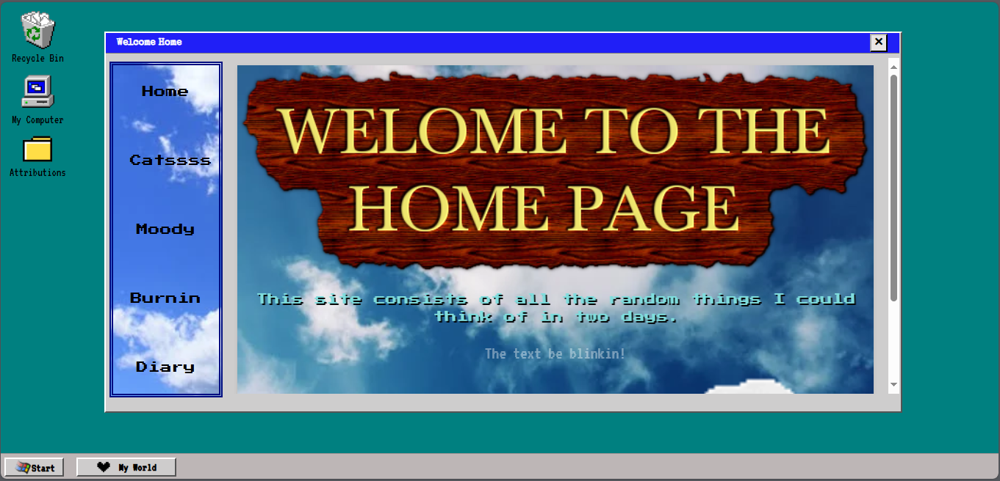

# Retro Windows-Style Website
This project is a retro-themed personal website featuring a 90s Windows-style UI. It showcases your skills, interests, and a love for nostalgia, all with the aesthetic of a classic Windows environment.

## Features
Home: A welcoming page with a vintage Windows interface.
Cats: A section dedicated to your love of cats, with cute and engaging content.
Mood Board: A fun space to share your mood, ideas, or creative inspirations.
Burnin: (incomplete)
Diary: An area to display tasks, updates, and more. (incomplete)

## Tech Stack
    Frontend: React, Tailwind CSS, HTML CSS
    Styling: Custom 90s retro style inspired by classic Windows UIs.
    Fonts: "Press Start 2P" for the retro text feel, and "VT323" for the terminal-inspired look.

## Live link
[Link](https://my-windowz.netlify.app/)

### Home section

### Resourses used doc
[Doc file](./Icon%20gif%20from%20gif%20cities.docx)
